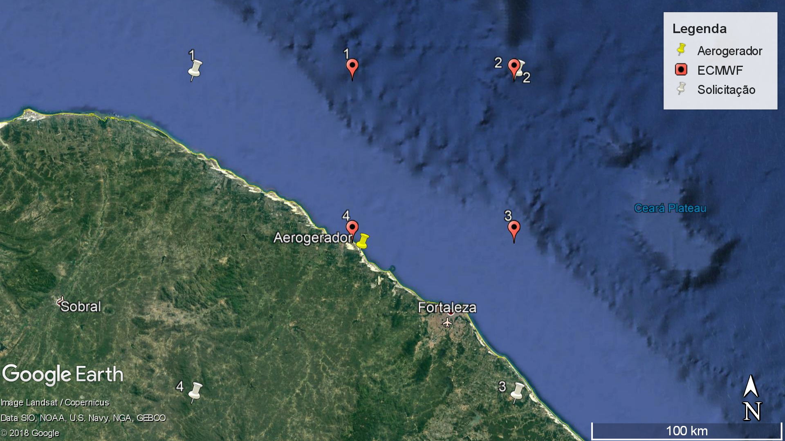

# Projeto de Introdução à Engenharia Eólica

## Intro
Projeto desenvolvido como conclusão da disciplina de Introdução à Engenharia Eólica 2019.1 no Centro de Energias Renováveis da UFPE. O trabalho almejava descrever um aerogerador ideal e seus parâmetros de operação. O artigo escrito encontra-se em no repositório como `Projeto - Eólica.pdf`.

## Gráficos

